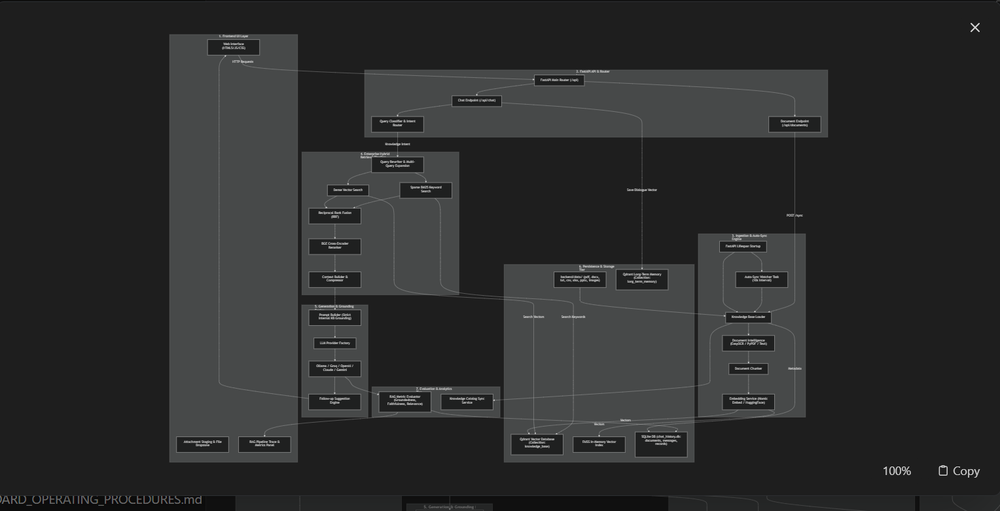

# 📖 Standard Operating Procedures (SOP) & Architecture Guide

Welcome to the **AI Advance RAG & Live Web Search Application**! This comprehensive guide provides a complete end-to-end breakdown of the application architecture, file directory structure, data flows, dependencies, setup instructions, database schemas, pipeline tracing, evaluation metrics, and deployment steps.

Architecture diagram


End to End pipeline


---

## 📋 Table of Contents
1. [🌟 Application Overview](#-application-overview)
2. [🏗️ Architecture & Technical Stack](#️-architecture--technical-stack)
3. [📊 System Data Flow Diagrams](#-system-data-flow-diagrams)
4. [📁 Complete Directory & File Guide](#-complete-directory--file-guide)
5. [📦 Key Packages & Libraries Used](#-key-packages--libraries-used)
6. [🚀 Step-by-Step Beginner Guide (Local to Web Deployment)](#-step-by-step-beginner-guide-local-to-web-deployment)
   - [Step 1: System Prerequisites](#step-1-system-prerequisites)
   - [Step 2: Virtual Environment Setup](#step-2-virtual-environment-setup)
   - [Step 3: Ollama Setup (Local LLM)](#step-3-ollama-setup-local-llm)
   - [Step 4: Launch Application Server](#step-4-launch-application-server)
   - [Step 5: Managing Busy Ports & Troubleshooting](#step-5-managing-busy-ports--troubleshooting)
   - [Step 6: Make Application Publicly Live via `npx` Tunnel](#step-6-make-application-publicly-live-via-npx-tunnel)
7. [⚙️ Centralized LLM & System Settings Management](#️-centralized-llm--system-settings-management)
8. [📂 SQLite Database Architecture & `chat_history_records` Table](#-sqlite-database-architecture--chat_history_records-table)
9. [📈 Real-Time RAG Evaluation & Response Metrics Card](#-real-time-rag-evaluation--response-metrics-card)
10. [🔁 Collapsible Pipeline Trace Panel](#-collapsible-pipeline-trace-panel)
11. [📊 Chat History & Retrieval Analytics Viewport & CSV Export](#-chat-history--retrieval-analytics-viewport--csv-export)
12. [💬 ChatGPT & Claude Style Chat History & Sidebar](#-chatgpt--claude-style-chat-history--sidebar)
13. [✨ Typography, Question/Context Cards & Clean Markdown](#-typography-questioncontext-cards--clean-markdown)
14. [🤖 Dynamic LLM-Based Greetings](#-dynamic-llm-based-greetings)
15. [🔍 Complete Features Breakdown](#-complete-features-breakdown)
16. [🌐 Website Knowledge Ingestion & Management Dashboard](#-website-knowledge-ingestion--management-dashboard)
17. [⚙️ Production Qdrant Scalability & Batching Ingestion](#-production-qdrant-scalability--batching-ingestion)
18. [💬 Persistent Response Metrics & Prompt Action Syncing](#-persistent-response-metrics--prompt-action-syncing)
19. [👍 RAG Learning & Retrieval Feedback Manager](#-rag-learning--retrieval-feedback-manager)

---

## 🌟 Application Overview

The **AI Advance RAG Application** is a production-grade Enterprise Retrieval-Augmented Generation (RAG) platform with multi-modal document ingestion, hybrid vector retrieval, live Web Search synthesis, real-time pipeline step tracing, RAG response metrics evaluation, relational chat history analytics, and centralized settings management.

### Key Capabilities:
- **Local & Cloud LLMs:** Runs locally using **Ollama** (Llama 3, Mistral, Phi-3) without needing any cloud API keys, while supporting API integrations for **OpenAI (GPT-4o)**, **Google Gemini**, **Anthropic Claude**, **Groq (LLaMA 3.3 70B)**, and **xAI Grok**.
- **Real-Time Response Metrics:** Every assistant turn evaluates and displays **Correctness %** (Answer Relevance), **Faithfulness %** (Context Groundedness), **Groundedness %** (Context Relevance), **Confidence %**, **Time Taken (seconds)**, and estimated **Token Cost** directly on the message bubble.
- **Collapsible Pipeline Trace Panel:** A collapsible bottom panel positioned below the prompt box tracks every backend step in real-time (Query Classification, Rewriting, Embedding Generation, Hybrid Search, Context Assembly, LLM Execution, and Evaluation).
- **Chat History & Retrieval Analytics Viewport:** Accessible via top-right header button (`<button id="top-history-btn">`). Features a **`← Back to RAG App`** button to return instantly to the active chat viewport. Stores 12 detailed relational columns in SQLite (`chat_history_records` table) with filterable search and **📥 CSV Export** (`/api/history/csv`).
- **ChatGPT & Claude Style Sidebar:** Sleek, minimal left sidebar dedicated exclusively to recent conversations with inline title renaming (`PUT /api/chats/{chat_id}`) and instant deletion (`DELETE /api/chats/{chat_id}`).
- **Snapshot-Style Formatting & Artifact Stripping:** Headings are rendered in crisp white bold typography (`Step X: ...`), sublabels (`The LLM receives:`, `Then generates:`), and structured Question/Context blocks inside dark rounded containers with monospace text and an inline copy button. Raw `#` and `*` markdown artifacts are automatically stripped.
- **Fixed Configuration Drawer Alignment:** Zero-gap, hardware-accelerated CSS transform positioning (`position: fixed; right: 0; transform: translateX(100%) -> translateX(0)`) ensuring the right drawer slides smoothly without leaving blank black space gaps.
- **Centralized Settings Single Source of Truth:** Synchronized LLM provider, sub-model selection, API keys, retriever params, and system prompt across UI & backend (`GET/PUT /api/settings`).
- **Hybrid Vector Retrieval:** Combines dense embeddings (via **Qdrant** / **FAISS** with `nomic-embed-text`) with sparse keyword retrieval (BM25) for high context relevance.

---

## 🏗️ Architecture & Technical Stack

```
+---------------------------------------------------------------------------------------+
|                              FRONTEND INTERFACE                                       |
|  - Modern Single-Page App (HTML5 + Glassmorphism CSS + Vanilla JavaScript ES6)        |
|  - Main Chat Viewport, Pipeline Trace Panel, & Chat History Analytics Viewport        |
+---------------------------------------------------------------------------------------+
                                           │  HTTP / REST API
                                           ▼
+---------------------------------------------------------------------------------------+
|                              BACKEND (FastAPI / Python 3.12+)                         |
|  - main.py / router.py                                                                |
|  - Routes: /api/chats, /api/documents, /api/search, /api/settings, /api/history       |
+---------------------------------------------------------------------------------------+
       │                                     │                                    │
       ▼                                     ▼                                    ▼
+-----------------------+   +-------------------------------+   +-----------------------+
|  LLM FACTORY & ROUTER |   |   HYBRID VECTOR RETRIEVAL     |   | RELATIONAL SQLITE DB  |
| - Ollama (Local)      |   | - Qdrant Vector DB (Dense)    |   | - chat_history.db     |
| - OpenAI (GPT-4o)     |   | - FAISS Store                 |   | - chat_history_records|
| - Gemini / Claude     |   | - BM25 Sparse Search          |   |   (12 Detailed Cols)  |
| - Groq / xAI Grok     |   | - BAAI BGE Reranker           |   | - CSV Export Engine   |
+-----------------------+   +-------------------------------+   +-----------------------+
```

### Core Technologies:
- **Backend Framework:** FastAPI (Python 3.12+)
- **ASGI Server:** Uvicorn (`http://0.0.0.0:8000`)
- **Database Engine:** SQLite (Stored in `backend/data/database_files/chat_history.db`)
- **Vector Stores:** Qdrant (Collection: `knowledge_base`, `long_term_memory`) & FAISS
- **Embeddings:** HuggingFace / Nomic (`nomic-embed-text`) & PyTorch
- **Reranker:** BAAI/bge-reranker-base
- **Frontend Stack:** HTML5, Modern Glassmorphism CSS, Vanilla ES6 JavaScript

---

## 📊 System Data Flow Diagrams

### 1. RAG Query & Pipeline Trace Flow:
```
User Prompt (Local/Web Mode)
  ──► Step 1: Query Classification (Intent: KNOWLEDGE / CODING / GREETING / etc.)
  ──► Step 2: Query Rewriting (Optimizes prompt for semantic search)
  ──► Step 3: Embedding Generation (Generates nomic-embed-text vector preview)
  ──► Step 4: Semantic & Keyword Search (Qdrant Dense + BM25 Fusion)
  ──► Step 5: Context Assembly (Formats retrieved snippets & citations)
  ──► Step 6: Send to LLM (Model status & execution)
  ──► Step 7: RAG Evaluation (Calculates Correctness, Faithfulness, Groundedness)
  ──► Log Detailed Record to SQLite `chat_history_records` Table
  ──► Return Response + Metrics Card + Pipeline Trace + Citations
```

### 2. Relational Analytics & CSV Export Flow:
```
User Clicks Top-Right "Chat History" Button (<button id="top-history-btn">)
  ──► Switches to `#history-viewport` (Hides Chat Viewport)
  ──► API Fetch: `GET /api/history`
  ──► Renders 12 Detailed Columns into Data Table
  ──► Click "Export CSV": Triggers `GET /api/history/csv`
  ──► Downloads `chat_history_analytics.csv` file directly for analysis
  ──► Click "← Back to RAG App": Switches back to active chat session
```

---

## 📁 Complete Directory & File Guide

```
AI_Advance_RAG_App/
│
├── backend/                        # Python Backend Source Code
│   ├── main.py                     # Entry point for FastAPI application
│   ├── settings.py                 # Pydantic environment configuration & settings
│   ├── lifespan.py                 # Application startup/shutdown lifespan tasks
│   ├── requirements.txt            # Python dependencies package list
│   │
│   ├── api/                        # API Routing Layer
│   │   ├── router.py               # Central APIRouter registering all sub-routers
│   │   └── routes/                 # Endpoint implementations
│   │       ├── chat.py             # Chat creation, messaging, memory, RAG generation, /api/history
│   │       ├── documents.py        # File upload, document listing, indexing, deletion
│   │       ├── search.py           # Google/DuckDuckGo live web search & synthesis
│   │       ├── settings.py         # Centralized system settings GET & PUT API
│   │       ├── url.py              # Webpage URL loader and vector indexer
│   │       ├── performance.py      # Real-time metrics & dashboard endpoint
│   │       └── health.py           # Server status health check
│   │
│   ├── memory/                     # SQLite Conversation & Registry Store
│   │   └── memory_service.py       # Manages conversations, messages, and chat_history_records table
│   │
│   ├── llm/                        # LLM Model Providers Layer
│   │   ├── config.py               # LLM Configuration dataclass
│   │   ├── factory.py              # Dynamic LLM provider instantiation factory
│   │   └── providers/              # Specific LLM Provider Implementations (Ollama, OpenAI, Gemini, Claude, Grok)
│   │
│   ├── services/                   # Core RAG Business Logic Services
│   │   ├── embedding_service.py    # Embedding generation using nomic-embed-text
│   │   ├── chunking/               # Semantic, Token, and Sentence Chunking modules
│   │   ├── ingestion/              # Loaders for PDF, DOCX, CSV, Text, Web URLs, and Image OCR
│   │   ├── retrieval/              # Dense, Sparse, Metadata Filtering, Query Rewriter
│   │   ├── generation/             # Prompt Builder & Answer Generator
│   │   └── vector_store/           # Qdrant and FAISS vector store managers
│   │
│   └── data/                       # Structured Data Repositories
│       ├── csv/ docx/ images/ pdf/ pptx/ txt/ xlsx/
│       └── database_files/         # Organized SQLite storage (chat_history.db, WAL files)
│
├── frontend/                       # Web Client Source Files
│   ├── index.html                  # Main Single Page App structure (Chat Viewport & History Viewport)
│   ├── style.css                   # Glassmorphism styling, metrics cards, pipeline trace, data tables
│   └── app.js                      # Core JS logic, pipeline panel handlers, history table renderer, API client
│
├── .env                            # Active environment variables store (API Keys, URLs)
├── start_tunnel.py                 # Helper Python script to expose local server via npx tunnel
├── Dockerfile                      # Container build configuration
├── docker-compose.yml              # Multi-container orchestration configuration
└── STANDARD_OPERATING_PROCEDURES.md# Complete System SOP & Developer Documentation
```

---

## 📦 Key Packages & Libraries Used

### Backend Dependencies (`backend/requirements.txt`):
| Package | Purpose |
|---|---|
| `fastapi` | High-performance Web API framework |
| `uvicorn[standard]` | Lightning-fast ASGI web server |
| `pydantic` / `pydantic-settings` | Data validation and `.env` settings management |
| `qdrant-client` | Client for Qdrant Vector Database |
| `faiss-cpu` | High-efficiency similarity search vector index |
| `torch` / `transformers` | Machine learning runtime for embeddings & reranking |
| `sentence-transformers` | HuggingFace embedding models (`nomic-embed-text`) |
| `pypdf` / `python-docx` / `python-pptx` | Document text extraction |
| `httpx` | Async HTTP client for cloud LLM API requests |
| `pytesseract` / `easyocr` / `Pillow` | Optical Character Recognition (OCR) for images |
| `beautifulsoup4` / `requests` | Web scraping and HTML parsing |

---

## 🚀 Step-by-Step Beginner Guide (Local to Web Deployment)

### Step 1: System Prerequisites
Ensure your machine has the following installed:
- **Python 3.12+**: Check using `python3 --version`
- **Node.js & npx**: Check using `npx --version`
- **Ollama**: Download from [ollama.com](https://ollama.com)

---

### Step 2: Virtual Environment Setup
Open your terminal and navigate to the project directory:

```bash
cd /Users/kanaram/Desktop/AI_Advance_RAG_App
```

Create and activate a Python virtual environment:
```bash
python3 -m venv venv
source venv/bin/activate
```

Install required packages:
```bash
pip install -r backend/requirements.txt
```

---

### Step 3: Ollama Setup (Local LLM)
Start Ollama and pull the default Llama 3 model:
```bash
ollama run llama3
```

---

### Step 4: Launch Application Server
To start the AI RAG server locally on port **8000**, run:

```bash
python -m uvicorn backend.main:app --host 0.0.0.0 --port 8000
```

Open your browser and navigate to:
👉 **`http://localhost:8000`**

---

### Step 5: Managing Busy Ports & Troubleshooting

If you encounter an error saying `Port 8000 is already in use`, run these commands:

1. **Check process using port 8000:**
   ```bash
   lsof -i :8000
   ```

2. **Terminate the process on port 8000 instantly:**
   ```bash
   kill -9 $(lsof -t -i :8000)
   ```

3. **1-Line Force-Restart Command:**
   ```bash
   lsof -ti :8000 | xargs kill -9 2>/dev/null; python -m uvicorn backend.main:app --host 0.0.0.0 --port 8000
   ```

---

### Step 6: Make Application Publicly Live via `npx` Tunnel

To share your application live on the internet:
```bash
npx localtunnel --port 8000
```

---

## ⚙️ Centralized LLM & System Settings Management

The application features a centralized Settings Service (`GET /api/settings` and `PUT /api/settings`):
- **Single Source of Truth:** Updating the active LLM provider or model from either the Settings Modal or Prompt Space LLM dropdown updates both immediately.
- **Persistence Across Sessions:** Selections and API keys are saved dynamically into `os.environ` and `.env`, maintaining state across browser refreshes and server restarts.

---

## 📂 SQLite Database Architecture & `chat_history_records` Table

All conversation histories, messages, document registries, and full analytics records are managed via SQLite inside **`backend/data/database_files/chat_history.db`**.

### `chat_history_records` Relational Schema:
```sql
CREATE TABLE IF NOT EXISTS chat_history_records (
    id TEXT PRIMARY KEY,
    timestamp_ist TEXT NOT NULL,
    user_prompt TEXT NOT NULL,
    retrieved_response TEXT NOT NULL,
    response_metrics TEXT,       -- JSON string of correctness, faithfulness, groundedness, confidence
    timetaken_s REAL,             -- Latency in seconds
    similarity_score REAL,        -- Top similarity score (or NULL)
    llm_model TEXT NOT NULL,      -- LLM model used
    memory_source TEXT,           -- 'Long-Term Memory', 'Short-Term Memory', 'None'
    files_used TEXT,              -- Filename(s) or NULL
    chunks_used TEXT,             -- Chunk IDs or NULL
    search_source TEXT NOT NULL,  -- 'Vector DB (Local)', 'Google / Web Search', 'LLM Direct Knowledge', 'Direct Attachment'
    created_at TIMESTAMP DEFAULT CURRENT_TIMESTAMP
)
```

---

## 📈 Real-Time RAG Evaluation & Response Metrics Card

Every assistant response automatically calculates and displays a **Response Metrics** card:
- **Correctness %:** Answer relevance score evaluating how well the answer addresses the prompt.
- **Faithfulness %:** Groundedness score measuring if facts in the answer are strictly supported by context.
- **Groundedness %:** Context relevance score evaluating context precision.
- **Confidence %:** Overall weighted average of all three metrics.
- **Time Taken:** Total response latency in seconds (e.g. `1.85s`).
- **Token Cost:** Estimated cost based on model provider pricing (e.g. `$0.0000 (Local)` or `~$0.0005`).

---

## 🔁 Collapsible Pipeline Trace Panel

The collapsible panel below the prompt space box displays real-time execution steps:
1. **Query Classification:** Identifies query intent (Knowledge, Coding, Greeting, etc.).
2. **Query Rewriting:** Rewrites prompt for semantic precision.
3. **Embedding Generation:** Converts prompt into vector embedding (shows dimension and vector sample).
4. **Semantic & Keyword Search:** Executes dense vector + BM25 sparse search.
5. **Context Assembly:** Assembles retrieved document chunks.
6. **Send to LLM:** Transmits context + prompt to active model.
7. **RAG Evaluation:** Computes final metrics.

---

## 📊 Chat History & Retrieval Analytics Viewport & CSV Export

- **Top Right Access:** Click the `<button id="top-history-btn">` in the header bar to launch the analytics view.
- **`← Back to RAG App` Button:** Positioned on the top-left to return instantly to your active chat session.
- **12 Relational Columns Table:** Displays `Unique ID`, `Timestamp (IST)`, `User Prompt`, `Retrieved Response`, `Response Metrics`, `Time Taken (s)`, `Similarity Score`, `LLM Model`, `Memory Source`, `File(s) Used`, `Chunk(s) Used`, and `Search Source`. Automatically populates `NULL` where applicable.
- **CSV Download:** Click **`📥 Export CSV`** (`/api/history/csv`) to download `chat_history_analytics.csv` for data science and auditing.

---

## 💬 ChatGPT & Claude Style Chat History & Sidebar

- **Minimalist Layout:** Unnecessary navigation menus have been removed, devoting the sidebar exclusively to recent chat history.
- **Inline Title Renaming:** Double-click or click the pencil icon to rename chat titles inline (`PUT /api/chats/{chat_id}`) with **Save (✓)** and **Cancel (✕)** buttons.
- **Instant Chat Deletion:** Click the trash icon to delete conversations from the SQLite database (`DELETE /api/chats/{chat_id}`).

---

## ✨ Typography, Question/Context Cards & Clean Markdown

- **Clean Headings:** Headings (`Step X: ...`) render in bold white text (`#ffffff`, `15.5px`) without raw `#` artifacts.
- **Sublabels & Cards:** `The LLM receives:` and `Then generates:` sublabels frame a dark rounded card (`rgba(255, 255, 255, 0.03)`) containing `Question:` and `Context:` with an inline top-right **Copy** button.
- **Artifact Stripping:** All stray `#` and `*` raw markdown characters are stripped from retrieved context and model outputs.

---

## 🤖 Dynamic LLM-Based Greetings

Simple user greetings (`hi`, `hello`, `hey`, `good morning`) bypass database retrieval for maximum speed and are answered directly by your active LLM model without hardcoded static messages.

---

## 🔍 Complete Features Breakdown

1. **Response Metrics Card on Message Bubbles:** Real-time Correctness, Faithfulness, Groundedness, Confidence, Latency, and Token Cost.
2. **Collapsible Pipeline Trace Panel:** Real-time 7-step execution trace below prompt box.
3. **Chat History & Retrieval Analytics Viewport:** 12-column relational data table with IST timestamps, similarity scores, memory/search sources, filter bar, and CSV export.
4. **`← Back to RAG App` Navigation:** Seamlessly switch between Analytics and Chat.
5. **ChatGPT / Claude Style Sidebar:** Dedicated conversation list with inline rename and delete.
6. **Zero-Gap Configuration Drawer:** Fixed hardware-accelerated drawer sliding flush against right viewport edge.
7. **Snapshot Formatting & Clean Text:** Monospace Question/Context cards, styled sublabels, and raw artifact stripping.
8. **Webpage URL & Document Ingestion:** Index public URLs and multi-modal files into Qdrant & FAISS.
9. **Centralized Settings & Persistence:** Synchronized LLM provider selection and API keys across sessions.
10. **Website Knowledge Ingestion Dashboard**: Global seeded config and user URL crawler panel with sitemap extraction, rate-limiting, and aggregate JSON backups.
11. **Production Qdrant Support**: Configures remote host connection and batched upserts to avoid lock contention and memory exhaustion.
12. **Persistent Response Metrics**: SQLite message metrics column storage to render RAG evaluation values even across app reloads.

---

## 🌐 Website Knowledge Ingestion & Management Dashboard

Introduced a modular website crawling and vector indexing pipeline accessible via the top-right globe icon:
- **Dashboard Interface (`/website`)**: An administration panel hosting KPI stats (Discovered, Crawled, Chunks, Embeddings), a submission form, a global config switcher to permit/block user-supplied ingestion, and an auto-refreshing list of active crawled websites with download and delete controls.
- **Auto-Discovery Sitemap Crawler**: Automatically extracts all URLs from a target `sitemap.xml`. If missing, it crawls the domain recursively up to a configurable depth and page limit. Handles robots.txt validation, removes duplicate URLs, respects server rate limits (polite rest timers), and strips script/menus/boilerplate tags.
- **Aggregate JSON backups**: Once a website is crawled, the system saves all pages into `backend/data/json/{website_friendly_name}.json` as a single file. Deleting a registered site automatically removes its JSON file.
- **Direct JSON Auto-Ingestion**: Placing any previously crawled dataset file inside `backend/data/json/` directory triggers the auto-sync watcher engine. It reads the custom page array format, parses title headers and content blocks, and indexes them directly into the vector database without re-crawling.

---

## ⚙️ Production Qdrant Scalability & Batching Ingestion

Optimized the backend for processing terabytes (TBs) of enterprise documentation:
- **Connection Routing**: Supports connecting to a remote **Qdrant Server cluster** by configuring the `QDRANT_URL` and `QDRANT_API_KEY` settings or environment variables, avoiding filesystem locking issues on concurrent background requests.
- **Batched Point Upserting**: The vector ingestion client splits point lists into small batches (default `100` points per request) to prevent memory overflows, HTTP timeouts, and gRPC payload size errors during large document uploads.
- **RAG Token Optimization**: Restricts retrieved knowledge fragments to top 3 matching chunks, significantly reducing prompt token count and API costs.

---

## 💬 Persistent Response Metrics & Prompt Action Syncing

Improved usability and data persistence in the chat view:
- **SQLite Schema Migration**: Added a persistent `metrics` column to the `messages` table. On startup, the system performs a backward-compatible migration (`ALTER TABLE messages ADD COLUMN metrics TEXT`) to preserve RAG response stats permanently.
- **Unconditional User Action Buttons**: User prompt boxes immediately display Copy, Edit, and Google Search buttons.
- **Dynamic Message ID Syncing**: While the model is generating, prompts use a temporary ID. Once saved, the response payload returns the final database user message ID, which updates the DOM element dynamically, allowing immediate editing and resubmitting.
- **Edit Loading Locks**: Shows warning toast notifications if the user attempts to edit a prompt while the assistant response is still streaming.

---

## 👍 RAG Learning & Retrieval Feedback Manager

The system incorporates a reinforcement feedback system to evaluate and improve RAG answer generation quality over time:
- **Interaction Data Logs**: Every user query and assistant response is logged as an interaction record inside `backend/data/query_dataset/`.
- **Feedback Collection Endpoint (`POST /api/dataset/feedback`)**: Users can submit positive (thumbs up) or negative (thumbs down) ratings for any assistant response. The rating updates the interaction record in the JSON store.
- **Analytics & Statistics (`GET /api/dataset/stats`)**: Computes real-time analytics including total query volume, total positive vs negative feedback count, and total disk size of the dataset.
- **Dataset Queries (`GET /api/dataset/queries`)**: Provides filtered access to recorded interactions, supporting date ranges, feedback type filters (all, positive, negative, unrated), and conversation ID scoping.
- **Data Export (`GET /api/dataset/export`)**: Allows administrators to export the filtered interaction database as a structured JSON payload for fine-tuning, training custom LLMs, or auditing RAG retrieval health.

---
*Created for AI RAG Developers, Contributors & Enterprise Teams.*
